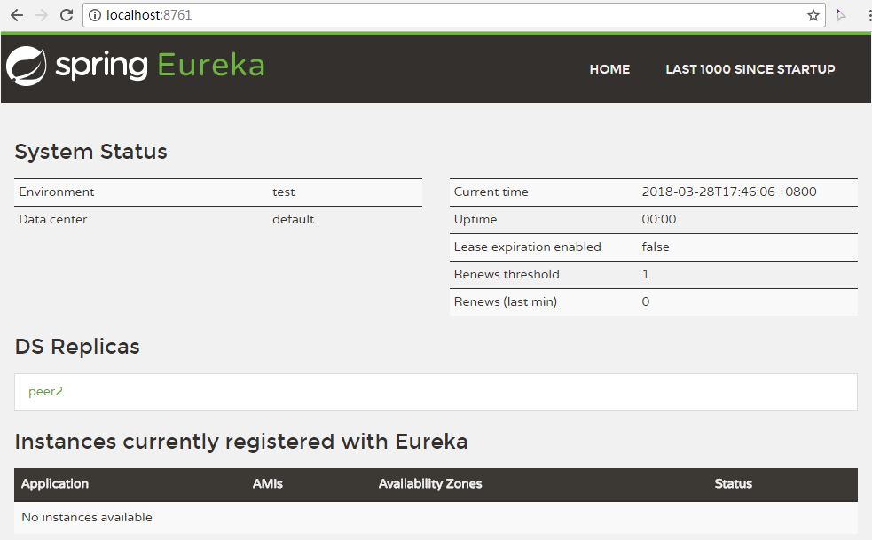

# 注册中心Eureka

Spring Cloud 封装了 Netflix 公司开发的 Eureka 模块来实现服务注册和发现。Eureka 采用了 C-S 的设计架构。Eureka Server 作为服务注册功能的服务器，它是服务注册中心。而系统中的其他微服务，使用 Eureka 的客户端连接到 Eureka Server，并维持心跳连接。这样系统的维护人员就可以通过 Eureka Server 来监控系统中各个微服务是否正常运行。Spring Cloud 的一些其他模块（比如Zuul）就可以通过 Eureka Server 来发现系统中的其他微服务，并执行相关的逻辑。

Eureka由两个组件组成：Eureka服务器和Eureka客户端。Eureka服务器用作服务注册服务器。Eureka客户端是一个java客户端，用来简化与服务器的交互、作为轮询负载均衡器，并提供服务的故障切换支持。Netflix在其生产环境中使用的是另外的客户端，它提供基于流量、资源利用率以及出错状态的加权负载均衡。

用一张图来认识以下：


上图简要描述了Eureka的基本架构，由3个角色组成：

1、Eureka Server

- 提供服务注册和发现

2、Service Provider

- 服务提供方
- 将自身服务注册到Eureka，从而使服务消费方能够找到

3、Service Consumer

- 服务消费方
- 从Eureka获取注册服务列表，从而能够消费服务

## 实践

### 注册中心

新建`registry-server`模块，pom文件如下所示：

```xml
<?xml version="1.0" encoding="UTF-8"?>
<project xmlns="http://maven.apache.org/POM/4.0.0"
         xmlns:xsi="http://www.w3.org/2001/XMLSchema-instance"
         xsi:schemaLocation="http://maven.apache.org/POM/4.0.0 http://maven.apache.org/xsd/maven-4.0.0.xsd">
    <modelVersion>4.0.0</modelVersion>

    <groupId>example.springcloud</groupId>
    <artifactId>eureka-server</artifactId>
    <version>0.0.1-SNAPSHOT</version>
    <packaging>jar</packaging>

    <parent>
        <groupId>org.springframework.boot</groupId>
        <artifactId>spring-boot-starter-parent</artifactId>
        <version>1.5.9.RELEASE</version>
        <relativePath/> <!-- lookup parent from repository -->
    </parent>

    <properties>
        <project.build.sourceEncoding>UTF-8</project.build.sourceEncoding>
        <project.reporting.outputEncoding>UTF-8</project.reporting.outputEncoding>
        <java.version>1.8</java.version>
        <spring-cloud.version>Dalston.SR5</spring-cloud.version>
    </properties>

    <dependencies>

        <dependency>
            <groupId>org.springframework.cloud</groupId>
            <artifactId>spring-cloud-starter</artifactId>
        </dependency>
        
        <dependency>
            <groupId>org.springframework.boot</groupId>
            <artifactId>spring-boot-starter-test</artifactId>
            <scope>test</scope>
        </dependency>
        
        <dependency>
            <groupId>org.springframework.cloud</groupId>
            <artifactId>spring-cloud-starter-eureka-server</artifactId>
        </dependency>

    </dependencies>

    <dependencyManagement>
        <dependencies>
            <dependency>
                <groupId>org.springframework.cloud</groupId>
                <artifactId>spring-cloud-dependencies</artifactId>
                <version>${spring-cloud.version}</version>
                <type>pom</type>
                <scope>import</scope>
            </dependency>
        </dependencies>
    </dependencyManagement>

    <build>
        <plugins>
            <plugin>
                <groupId>org.springframework.boot</groupId>
                <artifactId>spring-boot-maven-plugin</artifactId>
            </plugin>
        </plugins>
    </build>

    <repositories>
        <repository>
            <id>spring-milestones</id>
            <name>Spring Milestones</name>
            <url>https://repo.spring.io/milestone</url>
            <snapshots>
                <enabled>false</enabled>
            </snapshots>
        </repository>
    </repositories>

</project>
```

> 后面模块的pom跟这个都差不多，只是区别于`artifactId`和`dependencies`。后面新建模块，只给出`dependencies`中的配置。

新建启动类

```java
@SpringBootApplication
@EnableEurekaServer
public class RegistryApplication {
    public static void main(String[] args) {
        SpringApplication.run(RegistryApplication.class, args);
    }
}
```

新建`application.properties`

```properties
spring.application.name=registry-server
server.port=8761

# 是否将自己注册到Eureka Server
eureka.client.register-with-eureka=false
# 是否从Eureka Server获取注册信息
eureka.client.fetch-registry=false
eureka.client.serviceUrl.defaultZone=http://localhost:${server.port}/eureka/
```

启动工程后，访问http://localhost:8761/ ，看到Spring Eureka的界面。


到此，一个Eureka服务注册中心搭建完成。

### 注册中心集群

新建`application-peer1.properties`

```properties
server.port=8761
eureka.instance.hostname=peer1
```

新建`application-peer2.properties`

```properties
server.port=8762
eureka.instance.hostname=peer2
```

修改`application.properties`中的

```properties
eureka.client.serviceUrl.defaultZone=http://peer1:8761/eureka/,http://peer2:8762/eureka/
```

修改本地的host文件，添加

```
127.0.0.1 peer1  
127.0.0.1 peer2  
```

工程启动两次，分别带上参数

```
--spring.profiles.active=peer1
--spring.profiles.active=peer2
```

访问 http://localhost:8761/ 和 http://localhost:8762/ ，可以在`DS Replicas`看到对方。

