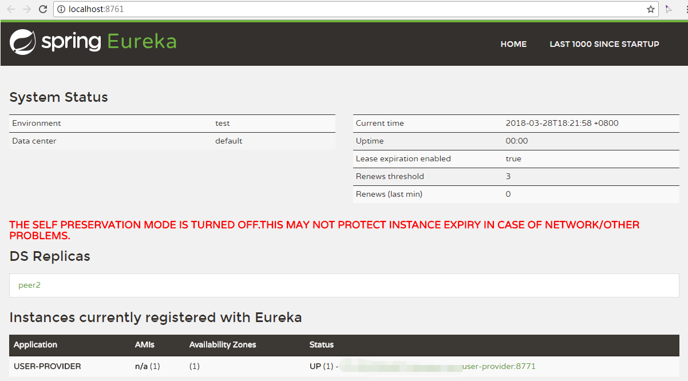

# 服务注册

在上节的注册中心基础上，我们添加个两个服务`user-provider`和`greeting-service`，前者返回用户信息，后者生成问候语句。

## User Provider

创建工程，pom中添加依赖：

```xml
<dependencies>
	<dependency>
		<groupId>org.springframework.cloud</groupId>
		<artifactId>spring-cloud-starter-eureka</artifactId>
	</dependency>
</dependencies>
```

创建启动类

```java
@SpringBootApplication
@EnableEurekaClient
public class UserProviderApplication {
    public static void main(String[] args) {
        SpringApplication.run(UserProviderApplication.class, args);
    }
}
```

>`EnableEurekaClient`也可以替换为`EnableDiscoveryClient`。前者是Eureka的专用客户端，后者是通用客户端。

提供Name服务

```java
@RestController
@RequestMapping("/users")
public class UserController {
    @Value("${account.user.name}")
    private String name;
    
    @RequestMapping("/name")
    public String getName() {
        return name;
    }
}
```

添加`application.properties`

```properties
spring.application.name=user-provider
server.port=8771
eureka.client.serviceUrl.defaultZone=http://localhost:8761/eureka/,http://localhost:8762/eureka/

account.user.name=guest
```

启动项目后，在Eureka中看到服务已经注册。



## Greeting Service

创建工程，pom添加

```xml
<dependencies>
	<dependency>
		<groupId>org.springframework.cloud</groupId>
		<artifactId>spring-cloud-starter-eureka</artifactId>
	</dependency>
    
    <dependency>
            <groupId>org.springframework.cloud</groupId>
            <artifactId>spring-cloud-starter-feign</artifactId>
        </dependency>
</dependencies>
```

创建启动类

```java
@SpringBootApplication
@EnableEurekaClient
@EnableFeignClients
public class GreetingServiceApplication {
    public static void main(String[] args) {
        SpringApplication.run(GreetingServiceApplication.class, args);
    }
}
```

- EnableFeignClients: 启用feign进行远程调用。feign包装了ribbon，可以与Eureka实现负载均衡。

添加Feign调用

```java
@FeignClient(name = "user-provider") // 与远程服务名称一致
public interface UserRemote {
    @RequestMapping("/users/name")  // 远程服务路径
    String getName();
}
```

添加mvc

```java
@RestController
public class GreetingController {
    @Autowired
    UserRemote userRemote;

    @RequestMapping("/hi")
    public String hi() {
        return "Hello, " + userRemote.getName();
    }
}
```

添加`application.properties`

```properties
spring.application.name=greeting-service
server.port=8775
eureka.client.serviceUrl.defaultZone=http://localhost:8761/eureka/,http://localhost:8762/eureka/
```

启动项目后，访问 http://localhost:8775/hi ，返回

```
Hello, guest
```

## 负载均衡

在`user-provider`中的`UserController`添加日志：

```java
@RestController
@RequestMapping("/users")
public class UserController {
    private static final Logger logger = LoggerFactory.getLogger(UserController.class);

    @RequestMapping("/name")
    public String getName() {
        logger.info("+++ Get name"); // add log
        return name;
    }
}
```

重新启动`user-provider`工程两次，指定不同端口

```
--server.port=8771
--server.port=8772
```

多次访问 http://localhost:8775/hi ，观察`user-provider`的日志，依次出现日志

````
+++ Get name
````


