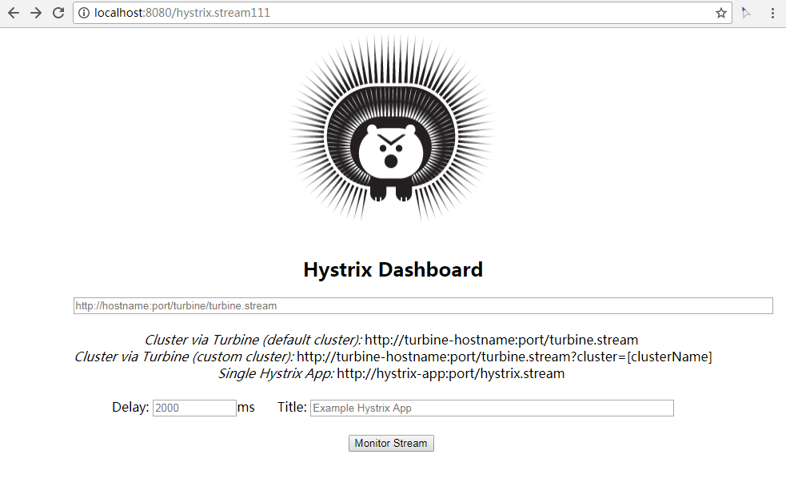

# Hystrix 监控

## 开启监控

pom添加依赖

```xml
        <dependency>
            <groupId>org.springframework.cloud</groupId>
            <artifactId>spring-cloud-starter-hystrix</artifactId>
        </dependency>

        <dependency>
            <groupId>org.springframework.boot</groupId>
            <artifactId>spring-boot-starter-actuator</artifactId>
        </dependency>
```

启动类开启监控接口。

```java
@EnableCircuitBreaker    // 开启监控
public class GreetingApplication { ... }
```

重启工程后，访问 http://localhost:8775/hystrix.stream ，不断返回ping结果。

## Dashboard

新建`hystrix-dashboard`项目，pom添加

```xml
        <dependency>
            <groupId>org.springframework.cloud</groupId>
            <artifactId>spring-cloud-starter-hystrix-dashboard</artifactId>
        </dependency>
```

新建启动类

```java
@SpringBootApplication
@EnableHystrixDashboard
public class HystrixDashboardApplication {
    public static void main(String[] args) {
        SpringApplication.run(HystrixDashboardApplication.class, args);
    }
}
```

添加`application.properties`

```properties
spring.application.name=hystrix-dashboard
server.port=8781
```

启动工程，浏览器访问 http://localhost:8781/hystrix 返回页面



输入框输入 http://localhost:8775/hystrix.stream ，点击`Monitor Stream`进入监控视图。如果之前没有请求，会显示`Loading ...`。访问 http://localhost:8775/hi 后，显示监控指标。指标含义见


## 集群监控

上面的Dashboard只能监控一个节点，如果有多个节点，则需要`Turbine`进行数据汇聚。修改上面的项目，pom添加

```xml
        <dependency>
            <groupId>org.springframework.cloud</groupId>
            <artifactId>spring-cloud-starter-eureka</artifactId>
        </dependency>

        <dependency>
            <groupId>org.springframework.cloud</groupId>
            <artifactId>spring-cloud-starter-turbine</artifactId>
        </dependency>
        
        <dependency>
            <groupId>org.springframework.cloud</groupId>
            <artifactId>spring-cloud-netflix-turbine</artifactId>
        </dependency>
```

启动类开启Turbine

```java
@EnableEurekaClient
@EnableTurbine
public class HystrixDashboardApplication { ... }
```

`application.properties`添加

```properties
eureka.client.serviceUrl.defaultZone=http://localhost:8761/eureka/,http://localhost:8762/eureka/

# 监控服务列表
turbine.app-config=greeting-service
# 集群列表
turbine.aggregator.clusterConfig=default
turbine.clusterNameExpression=new String("default")
```


重启项目，在  http://localhost:8781/hystrix 页面添加监控流

```
http://localhost:8781/turbine.stream
```

