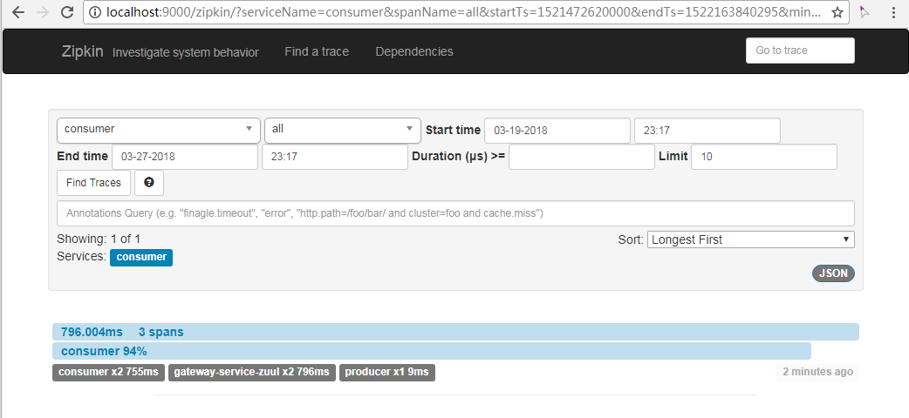

# 链路跟踪 Zipkin

## 服务端

新建工程，pom添加

```xml
        <dependency>
            <groupId>io.zipkin.java</groupId>
            <artifactId>zipkin-server</artifactId>
        </dependency>
        <dependency>
            <groupId>io.zipkin.java</groupId>
            <artifactId>zipkin-autoconfigure-ui</artifactId>
        </dependency>
```

新建启动类

```java
@SpringBootApplication
@EnableEurekaClient
@EnableZipkinServer
public class TracerServerApplication {
    public static void main(String[] args) {
        SpringApplication.run(TracerServerApplication.class, args);
    }
}
```

启动工程，访问 http://localhost:8795/zipkin/ ，得到



## 客户端

修改`greeting-service`和`user-provider`，pom添加

```xml
<dependency>
    <groupId>org.springframework.cloud</groupId>
    <artifactId>spring-cloud-starter-zipkin</artifactId>
</dependency>
```

`application.properties`添加

```properties
spring.zipkin.base-url=http://localhost:9000
spring.sleuth.sampler.percentage=1.0
```

重新工程。

## 验证

访问 http://localhost:8775/hi ，浏览器访问<http://localhost:9000/zipkin/> 打开跟踪器视图，选择合适的时间段，点击`Find Traces`，显示出刚才的访问链路。